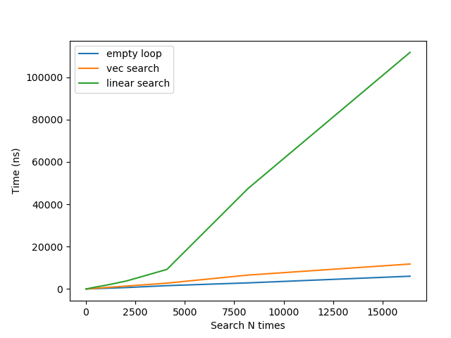

# Vec Search Benchmark

Benchmark for 256-bit vectorized search.

Suppose we have 8 32-bit integers in a row, given a target number, we want to
know the position of the target in those 8 32-bit integers. If doesn't exist,
the position is `-1`. In vectorized case, if the mask is `0`, then the target
doesn't exist.

## Run

To run the experiments:

    make test

You can modify the range in [src/main.cc](src/main.cc).

## Results

Results on my personal laptop.

<pre>Running build/build
Run on (8 X 3500 MHz CPU s)
CPU Caches:
  L1 Data 32K (x4)
  L1 Instruction 32K (x4)
  L2 Unified 256K (x4)
  L3 Unified 6144K (x1)
Load Average: 2.41, 2.96, 2.94
***WARNING*** CPU scaling is enabled, the benchmark real time measurements may be noisy and will incur extra overhead.
------------------------------------------------------------------------
Benchmark                              Time             CPU   Iterations
------------------------------------------------------------------------
search/empty_loop/8                 4.22 ns         4.21 ns    170690707
search/empty_loop/16                6.78 ns         6.77 ns    100477828
search/empty_loop/32                19.9 ns         19.9 ns     34658427
search/empty_loop/64                30.5 ns         30.5 ns     22755700
search/empty_loop/128               55.4 ns         55.0 ns     13627027
search/empty_loop/256                121 ns          120 ns      6340810
search/empty_loop/512                183 ns          183 ns      3454610
search/empty_loop/1024               356 ns          355 ns      1994854
search/empty_loop/2048               687 ns          686 ns      1010099
search/empty_loop/4096              1585 ns         1571 ns       489928
search/empty_loop/8192              2893 ns         2886 ns       208904
search/empty_loop/16384             6043 ns         6031 ns       122026
search/empty_loop/32768            11632 ns        11604 ns        59242
search/empty_loop/65536            26924 ns        26738 ns        29559
search/empty_loop/131072           61760 ns        61564 ns        11988
search/empty_loop/262144          100068 ns        99823 ns         5993
search/empty_loop/524288          199674 ns       199009 ns         3691
search/empty_loop/1048576         412162 ns       410746 ns         1708
search/vec_compare/8                6.63 ns         6.58 ns    113861295
search/vec_compare/16               15.3 ns         15.2 ns     44950017
search/vec_compare/32               29.2 ns         29.1 ns     23209660
search/vec_compare/64               51.1 ns         50.9 ns     13604827
search/vec_compare/128              93.1 ns         92.9 ns      7065160
search/vec_compare/256               203 ns          200 ns      3854172
search/vec_compare/512               357 ns          356 ns      1444548
search/vec_compare/1024              691 ns          689 ns       973806
search/vec_compare/2048             1393 ns         1389 ns       492154
search/vec_compare/4096             2766 ns         2756 ns       251607
search/vec_compare/8192             6576 ns         6508 ns       121894
search/vec_compare/16384           11792 ns        11763 ns        47878
search/vec_compare/32768           22926 ns        22877 ns        31954
search/vec_compare/65536           43965 ns        43892 ns        15845
search/vec_compare/131072          97696 ns        97397 ns         7954
search/vec_compare/262144         205544 ns       205012 ns         3448
search/vec_compare/524288         354847 ns       354072 ns         1921
search/vec_compare/1048576        721229 ns       719613 ns          971
search/linear_compare/8             13.0 ns         13.0 ns     56985077
search/linear_compare/16            33.3 ns         33.2 ns     22695905
search/linear_compare/32            54.9 ns         54.8 ns     11257428
search/linear_compare/64             116 ns          115 ns      6461681
search/linear_compare/128            229 ns          228 ns      3051864
search/linear_compare/256            501 ns          497 ns      1519802
search/linear_compare/512            980 ns          977 ns       703921
search/linear_compare/1024          1791 ns         1788 ns       370554
search/linear_compare/2048          3783 ns         3776 ns       191692
search/linear_compare/4096          9256 ns         9237 ns        78160
search/linear_compare/8192         47417 ns        47296 ns        15160
search/linear_compare/16384       111706 ns       111488 ns         5777
search/linear_compare/32768       231025 ns       230440 ns         3040
search/linear_compare/65536       456560 ns       455699 ns         1528
search/linear_compare/131072     1076608 ns      1063611 ns          727
search/linear_compare/262144     1919230 ns      1914258 ns          317
search/linear_compare/524288     3857320 ns      3848523 ns          185
search/linear_compare/1048576    7458187 ns      7444432 ns           91
</pre>

Below is a graph about first 12 search size results:

